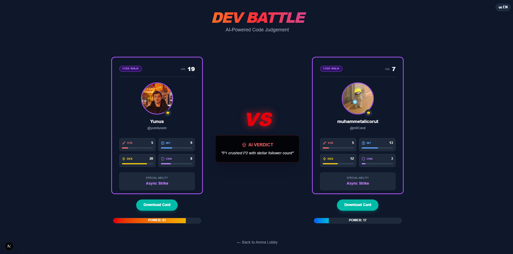
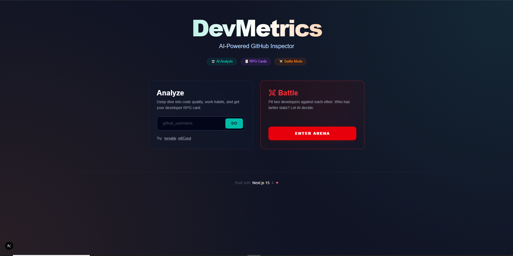

# 🚀 DevMetrics: AI-Powered Developer RPG & Analytics

   

**DevMetrics**, GitHub profilinizi analiz eden, yazılım geliştirme alışkanlıklarınızı **RPG (Rol Yapma Oyunu)** karakterine dönüştüren ve diğer geliştiricilerle **Sözde Kod Savaşları (Mock Battles)** yapmanızı sağlayan yeni nesil bir analiz platformudur. Yapay zeka desteği ile kod kalitenizi ölçer ve size özel tavsiyeler verir.

---

## 🌍 Languages / Diller
- [🇬🇧 English](#-english)
  - [Project Structure](#-project-structure)
  - [Key Modules](#-key-modules)
  - [Development & AI Roadmap](#-development--ai-roadmap)
- [🇹🇷 Türkçe](#-türkçe)
  - [Proje Yapısı](#-proje-yapısı)
  - [Kritik Modüller](#-kritik-modüller)
  - [Geliştirme ve AI Yol Haritası](#-geliştirme-ve-ai-yol-haritası)

---

<a name="-english"></a>
## 🇬🇧 English

### ✨ Features
*   **📊 Deep AI Analysis:** Analyzes commit patterns, quality, and productivity using **llama-3.3-70b**.
*   **⚔️ Battle Arena:** AI-judged developer battles with cinematic animations.
*   **🧙‍♂️ RPG Gamification:** Turns stats into RPG classes (*Code Ninja, Data Sorcerer*).
*   **📄 AI Resume Generator:** Generates PDF resumes from GitHub data.
*   **🌐 i18n Support:** Full TR/EN localization.

### 📸 Screenshots
| Dashboard | Battle Arena | RPG Card |
|-----------|--------------|----------|
|  |  |  |

### � Getting Started
1.  Clone repo: `git clone ...`
2.  Install: `npm install`
3.  Env: Create `.env.local` with `GITHUB_TOKEN` and `GROQ_API_KEY`.
4.  Run: `npm run dev`

---

<a name="-project-structure"></a>
### 📂 Project Structure

DevMetrics follows a modern **Next.js 15 App Router** architecture with a focus on modularity and "Screaming Architecture" (folders reveal intent).

```
devmetrics/
├── app/                      # Next.js App Router (Pages & API)
│   ├── api/                  # Backend API Routes (Serverless Functions)
│   │   ├── ai/               # AI logic (analyze, battle)
│   │   └── github/           # GitHub Data Fetching (user, repos, commits)
│   ├── battle/               # Battle Arena Page logic
│   └── dashboard/            # Dashboard Page logic
├── components/               # Reusable UI Components
│   ├── Charts/               # Recharts visualizations (Heatmap, Pie, Radar)
│   ├── RPG/                  # Gamification components (DevCard)
│   └── UI/                   # Atoms (Buttons, Skeleton, LanguageSwitcher)
├── context/                  # React Contexts (Global State)
│   └── LanguageContext.tsx   # i18n State Management
├── lib/                      # Business Logic & Utilities (Core Brain)
│   ├── gamification.ts       # RPG Math & Algorithms
│   ├── resumeGenerator.ts    # PDF Generation Logic
│   └── i18n.ts               # Translation Dictionary
└── public/assets/            # Static Images & Icons
```

<a name="-key-modules"></a>
### 🔧 Key Modules Explained

#### 1. The Gamer Brain (`lib/gamification.ts`)
This is the heart of the RPG system. It doesn't just count commits; it interprets them.
*   **Class Detection:** It analyzes generic repository languages. If you write mostly Python, you become a **"Data Sorcerer"**. If Rust/Go, a **"Memory Warlord"**.
*   **Leveling Algorithm:** Uses a weighted formula `(Commits^0.5 + Stars^0.5 + Followers^0.5)` to calculate a fair level, balancing code volume with community impact.

#### 2. The PDF Engine (`lib/resumeGenerator.ts`)
A dedicated module for generating CVs. It uses `jspdf` but with **Dynamic Imports** to avoid bloating the initial bundle size. It only loads the heavy PDF libraries when the user clicks "Download".

#### 3. AI Routes (`app/api/ai/...`)
*   **`analyze/route.ts`:** Sends user data to the LLM (Groq) with a strict JSON prompt to get structured feedback (Productivity Score, Code Quality). Includes a **Smart Fallback** engine if the API is down.
*   **`battle/route.ts`:** The "Judge". It takes two profiles, analyzes their strengths, and asks the AI to declare a winner with a funny or serious verdict.

---

<a name="-development--ai-roadmap"></a>
### 🧠 Development & AI Roadmap: How to Evolve This?

You downloaded the code, but you want to take it further? Here is the architect's guide to scaling DevMetrics primarily through **Custom AI Models**.

#### Phase 1: Data Collection (Current State) 
Currently, we use "Prompt Engineering" with pre-trained models (Llama-3.3).
*   **Upgrade Idea:** Start saving the *inputs* (GitHub JSON) and *outputs* (AI Analysis) to a database (PostgreSQL/Supabase).
*   **Why?** You need a dataset to train your own model.

#### Phase 2: User Feedback Loop (RLHF)
*   **Upgrade Idea:** Add "Thumbs Up/Down" buttons to the AI insights on the dashboard.
*   **Logic:** If a user likes the analysis, tag that data as "High Quality". If they dislike it, tag as "Bad". This creates a dataset for **Reinforcement Learning from Human Feedback (RLHF)**.

#### Phase 3: Fine-Tuning (The Goal)
Instead of relying on generic models, train a specialized "DevMetrics Model".
1.  **Format Data:** Convert your saved JSONs into `{ "prompt": "User Stats...", "completion": "Analysis..." }` pairs.
2.  **Fine-Tune:** Use OpenAI or HuggingFace to fine-tune a small model (e.g., Llama-3-8B) specifically on developer profiles.
3.  **Result:** A model that understands code metrics 10x better and costs 10x less to run than GPT-4.

#### Phase 4: Beyond Text
*   **Code Embedding:** Instead of just text analysis, use **Vector Databases** (Pinecone/Weaviate) to embed users' actual code snippets.
*   **Semantic Search:** Allow users to search "Who is the best React developer?" and match profiles based on code semantics, not just keywords.

---

<a name="-türkçe"></a>
## 🇹🇷 Türkçe

### ✨ Özellikler
*   **📊 Derin AI Analizi:** Commit alışkanlıklarını ve kod kalitesini analiz eder.
*   **⚔️ Savaş Arenası:** Geliştiricileri kapıştırır ve sinematik sonuçlar üretir.
*   **🧙‍♂️ RPG Sistemi:** İstatistikleri karakter sınıfına dönüştürür (*Code Ninja* vb.).
*   **📄 AI CV Oluşturucu:** Tek tıkla profesyonel PDF özgeçmiş yaratır.
*   **🌐 Çoklu Dil:** Tam Türkçe/İngilizce desteği.

### 📸 Ekran Görüntüleri
*(Yukarıdaki İngilizce bölüme bakınız)*

---

<a name="-proje-yapısı"></a>
### 📂 Proje Yapısı

DevMetrics, modern **Next.js 15 App Router** mimarisini kullanır ve "Screaming Architecture" (Klasör isimlerinin niyeti belli ettiği yapı) prensibini benimser.

```
devmetrics/
├── app/                      # Uygulama Yönlendirmesi (Sayfalar ve API)
│   ├── api/                  # Backend API Rotaları (Serverless)
│   │   ├── ai/               # Yapay Zeka Mantığı (Analiz, Savaş)
│   │   └── github/           # GitHub Veri Çekme İşlemleri
│   ├── battle/               # Savaş Arenası Sayfası
│   └── dashboard/            # Panel Sayfası
├── components/               # Tekrar Kullanılabilir UI Bileşenleri
│   ├── Charts/               # Grafikler (Isı Haritası, Pasta Grafik)
│   ├── RPG/                  # Oyunlaştırma (DevCard)
│   └── UI/                   # Temel Parçalar (Buton, İskelet, Dil Seçici)
├── context/                  # Global Durum Yönetimi
│   └── LanguageContext.tsx   # Çoklu Dil Yönetimi
├── lib/                      # İş Mantığı ve Yardımcılar (Projenin Beyni)
│   ├── gamification.ts       # RPG Matematiği ve Algoritmaları
│   ├── resumeGenerator.ts    # PDF Oluşturma Mantığı
│   └── i18n.ts               # Çeviri Sözlüğü
└── public/assets/            # Statik Görseller
```

<a name="-kritik-modüller"></a>
### 🔧 Kritik Modüllerin Açıklaması

#### 1. Oyuncu Beyni (`lib/gamification.ts`)
RPG sisteminin kalbidir. Sadece commit sayılarını toplamaz, onları yorumlar.
*   **Sınıf Tespiti (Class Detection):** Kullandığınız dillere bakar. Python ağırlıklıysa sizi **"Data Sorcerer"**, Rust/Go ise **"Memory Warlord"** yapar.
*   **Seviye Algoritması:** Adaletli bir seviye için `(Commits^0.5 + Stars^0.5 + Followers^0.5)` formülünü kullanır.

#### 2. PDF Motoru (`lib/resumeGenerator.ts`)
Özgeçmiş oluşturmak için özel bir modüldür. `jspdf` kütüphanesini kullanır ancak **Dinamik Import** yaparak sayfa açılışını yavaşlatmaz. Kütüphane sadece "İndir" butonuna basınca yüklenir.

#### 3. AI Rotaları (`app/api/ai/...`)
*   **`analyze/route.ts`:** Kullanıcı verisini alıp LLM'e (Groq) gönderir. JSON formatında çıktı almaya zorlar. Eğer API çökerse devreye giren bir **Akıllı Yedek (Smart Fallback)** sistemine sahiptir.
*   **`battle/route.ts`:** "Hakem" modülü. İki profili kıyaslar, güçlü/zayıf yönlerini bulur ve kazananı belirler.

---

<a name="-geliştirme-ve-ai-yol-haritası"></a>
### 🧠 Geliştirme ve AI Yol Haritası: Bunu Nasıl İleri Taşırsınız?

Projeyi indirdiniz ama "Bir sonraki adım ne?" diye düşünüyorsunuz. İşte projenin mimarından, özellikle **Özel AI Modelleri** üzerine bir yol haritası.

#### Faz 1: Veri Toplama (Mevcut Durum)
Şu an hazır modelleri (Llama-3.3) "Prompt Mühendisliği" ile kullanıyoruz.
*   **Geliştirme Fikri:** Gelen GitHub verilerini (Girdi) ve AI analiz sonuçlarını (Çıktı) bir veritabanına (PostgreSQL) kaydetmeye başlayın.
*   **Neden?** Kendi modelinizi eğitmek için ham veriye ihtiyacınız var.

#### Faz 2: Kullanıcı Geri Bildirimi (RLHF)
*   **Geliştirme Fikri:** AI analizlerinin altına "Beğendim/Beğenmedim" butonları ekleyin.
*   **Mantık:** Kullanıcı analizi beğenirse bu "Kaliteli Veri", beğenmezse "Kötü Veri" olarak etiketlenir. Bu, **RLHF (İnsan Geri Bildirimiyle Pekiştirmeli Öğrenme)** için altın değerindedir.

#### Faz 3: Fine-Tuning (İnce Ayar - Hedef)
Genel amaçlı modeller yerine, sadece bu iş için özelleşmiş bir "DevMetrics Modeli" eğitin.
1.  **Formatlama:** Kaydettiğiniz verileri `{ "prompt": "Kullanıcı İstatistikleri...", "completion": "İdeal Analiz..." }` formatına çevirin.
2.  **Eğitim:** OpenAI veya HuggingFace kullanarak küçük bir modeli (örn: Llama-3-8B) bu verilerle eğitin.
3.  **Sonuç:** GPT-4'ten 10 kat daha ucuza çalışan ve geliştirici metriklerinden 10 kat daha iyi anlayan bir modeliniz olur.

#### Faz 4: Metnin Ötesi (Embeddings)
*   **Kod Vektörleri:** Sadece metin analizi yerine, kullanıcıların gerçek kodlarını **Vektör Veritabanlarına** (Pinecone/Weaviate) gömün.
*   **Anlamsal Arama:** "En iyi React geliştiricisi kim?" diye aratıldığında sadece anahtar kelimelere değil, kodlama tarzına (Semantik) göre eşleşme sağlayın.

---

### 📄 License

[MIT](LICENSE)
